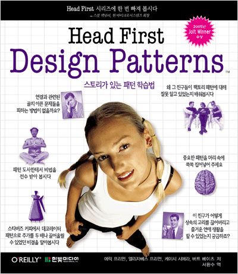

# HeadFirstDesignPatterns

헤드퍼스트 디자인 패턴

* ### 스트래티지 패턴
  - [SimUDuck 연못 시뮬리에이션 게임 예제](https://github.com/KDJ0899/HeadFirstDesignPatterns/tree/master/src/strategy_pattern/simuduck)

* ### 옵저버 패턴
  * [기상스테이션 예제](https://github.com/KDJ0899/HeadFirstDesignPatterns/tree/master/src/observer_pattern)

* ### 데코레이터 패턴
  * [커피샵 예제](https://github.com/KDJ0899/HeadFirstDesignPatterns/tree/master/src/decorater_pattern)

* ### 팩토리 패턴
  * [DOS프로젝트 아이템](https://github.com/KDJ0899/Project_DOS/tree/master/src/com/dos/item)에 실적용. 
  * [팩토리 메소드 패턴 vs 추상 팩터리 패턴](https://beomseok95.tistory.com/246) 참고.

* ### 싱글턴 패턴
  * [DOS프로젝트 아이템](https://github.com/KDJ0899/Project_DOS/tree/master/src/com/dos/item) 서브 클래스 ScreenBlock, Silence, SpeedUp에 적용.
  
* ### 커맨트 패턴
  *[리모컨 예제](https://github.com/KDJ0899/HeadFirstDesignPatterns/tree/master/src/command_pattern)
